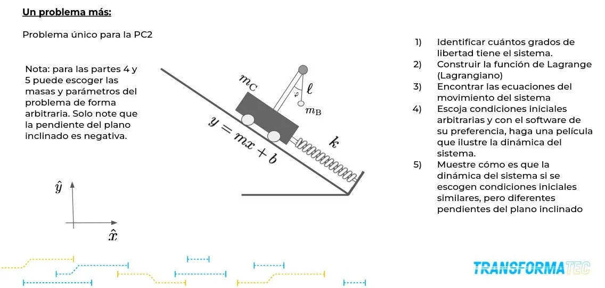

##  Descripción del problema

Se estudia el comportamiento dinámico de un sistema mecánico compuesto por un carrito que se desplaza sobre un plano inclinado y un péndulo unido a él.

El sistema está sometido a la acción de la gravedad, la fuerza de un resorte y la interacción entre el movimiento traslacional del carrito y la oscilación del péndulo. Esta interacción genera un sistema dinámico acoplado cuya evolución depende de los parámetros físicos involucrados.

El objetivo es modelar el sistema utilizando el formalismo de Euler-Lagrange, obteniendo las ecuaciones de movimiento que describen su comportamiento en el tiempo, y analizar cómo varía la dinámica al modificar las condiciones del sistema.

---

## Representación del sistema

